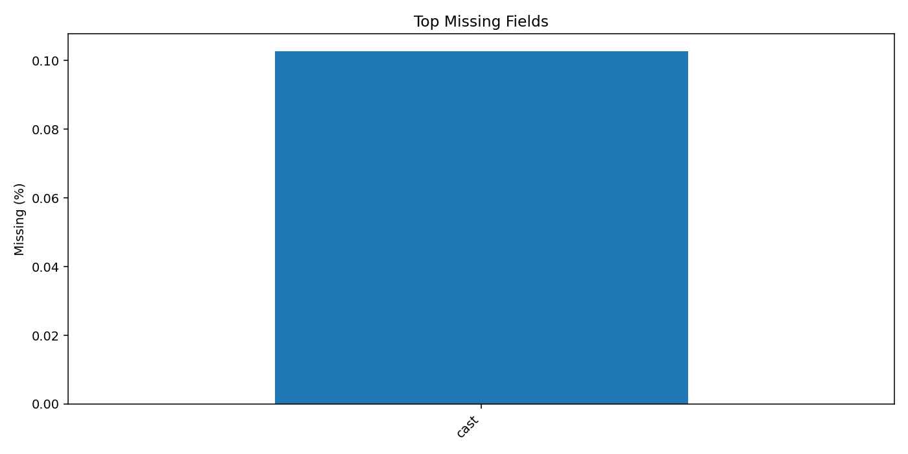
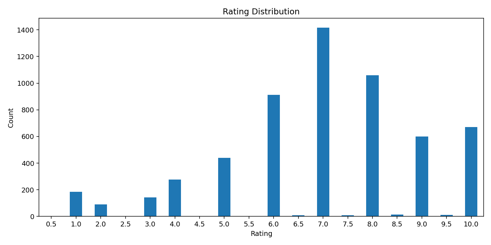
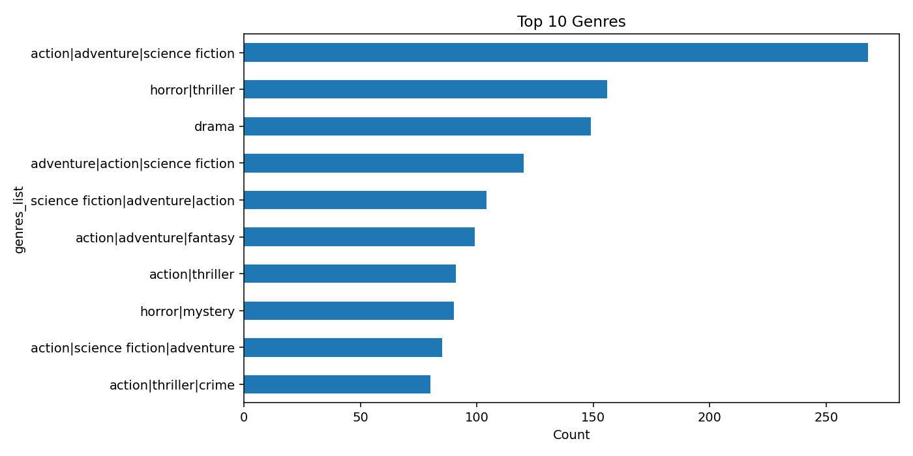
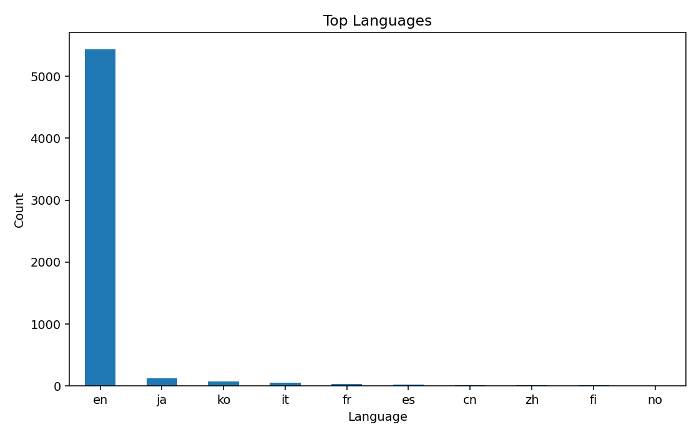
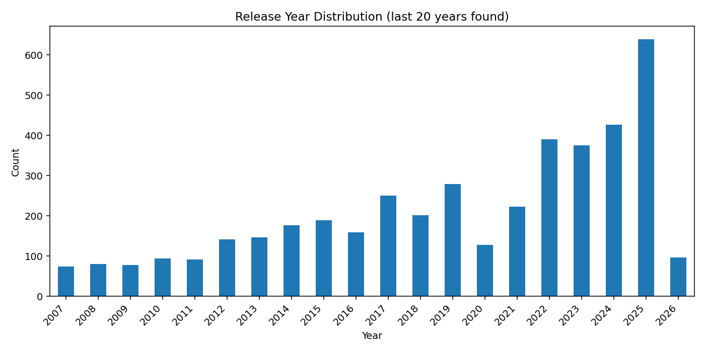

# Dataset Evaluation: movie_final_dataset

## Source
- source file: `data/movie_final_dataset.csv`
- cleaned file: `data/cleaned/movie_final_dataset_cleaned.csv`

## Size Snapshot
- rows before cleaning: 10000
- rows after cleaning: 5845
- columns: 13

## Cleaning Actions
- exact duplicate rows removed: 4155
- rows removed due to missing core fields (`user_id`, `movie_id`, `rating`): 0

## Missing Data (Top Fields)
- `cast`: 0.10%

## Rating Balance Check
- negative: 423
- neutral: 1641
- positive: 3781
- min/max class ratio: 0.112
- verdict: **imbalanced**

## Visualizations
- 
- 
- 
- 
- 

## Recommendation
Dataset is imbalanced for rating-class tasks; apply resampling or class-weighted training if you build a classifier.
