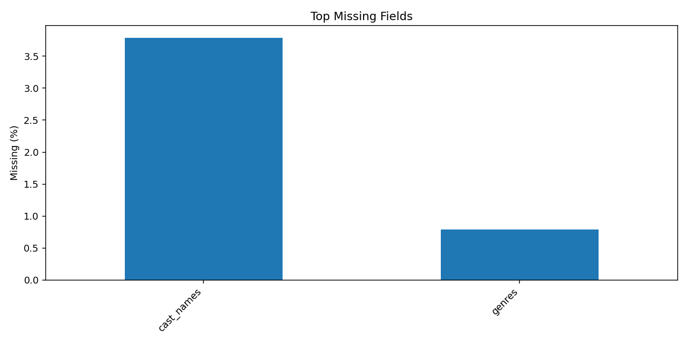
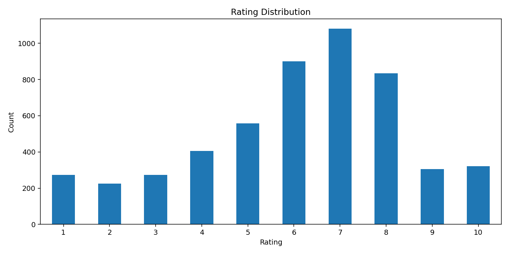
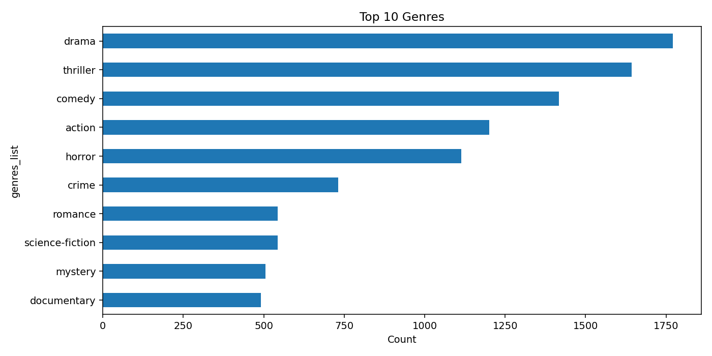
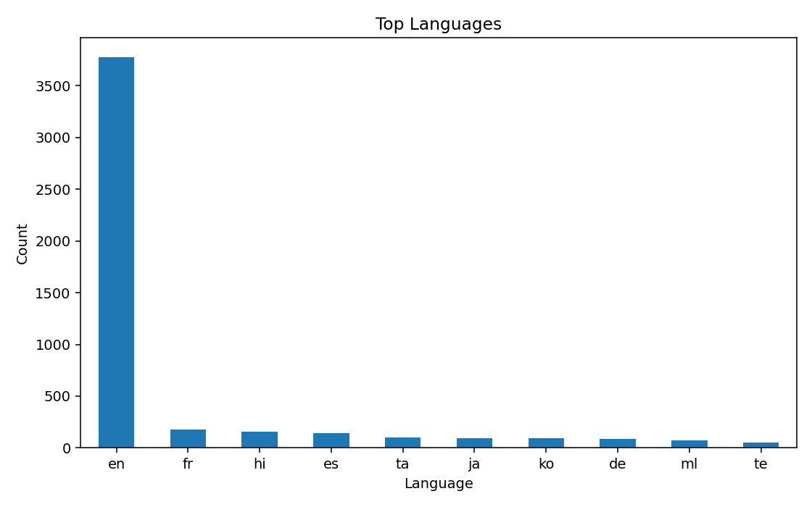
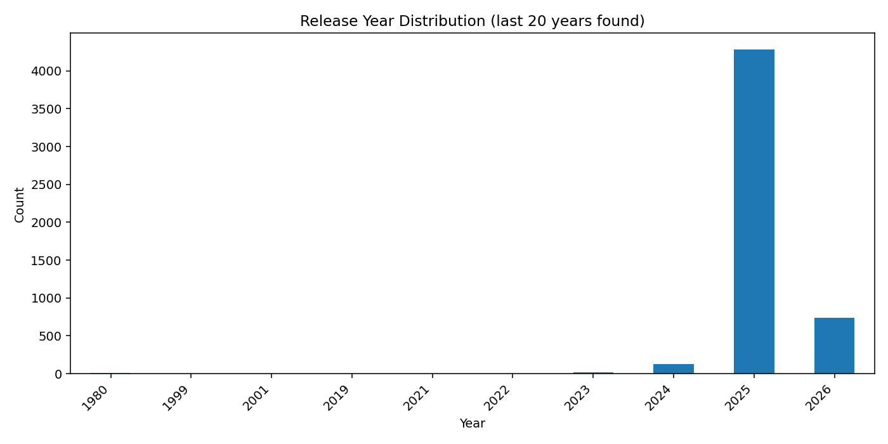

# Dataset Evaluation: trakt_ultimate_checkpoint

## Source
- source file: `data/trakt_ultimate_checkpoint.csv`
- cleaned file: `data/cleaned/trakt_ultimate_checkpoint_cleaned.csv`

## Size Snapshot
- rows before cleaning: 10000
- rows after cleaning: 5177
- columns: 16

## Cleaning Actions
- exact duplicate rows removed: 4823
- rows removed due to missing core fields (`user_id`, `movie_id`, `rating`): 0

## Missing Data (Top Fields)
- `cast_names`: 3.79%
- `genres`: 0.79%

## Rating Balance Check
- negative: 772
- neutral: 1863
- positive: 2542
- min/max class ratio: 0.304
- verdict: **imbalanced**

## Visualizations
- 
- 
- 
- 
- 

## Recommendation
Dataset is imbalanced for rating-class tasks; apply resampling or class-weighted training if you build a classifier.
